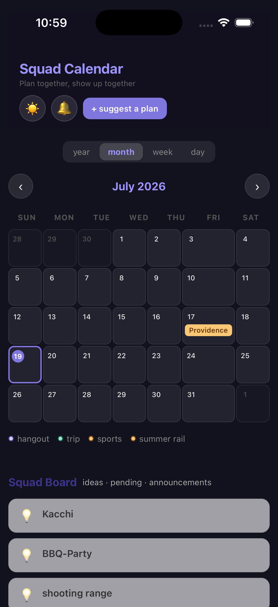
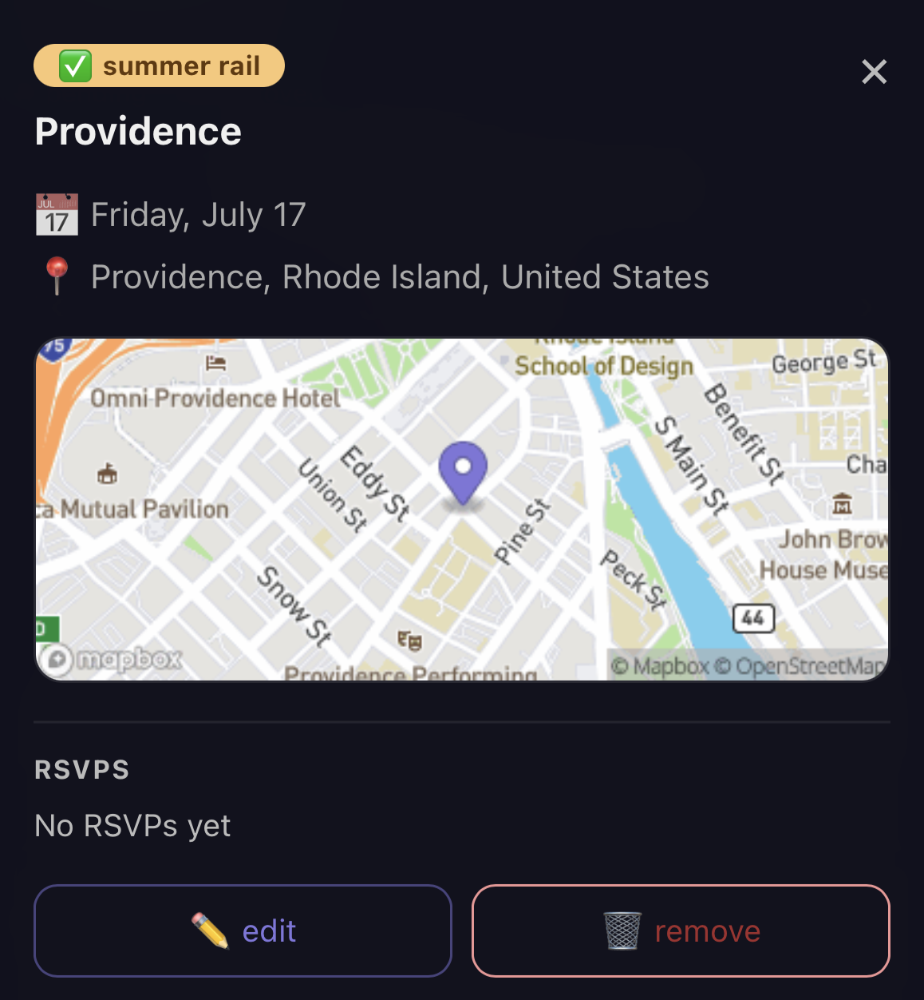
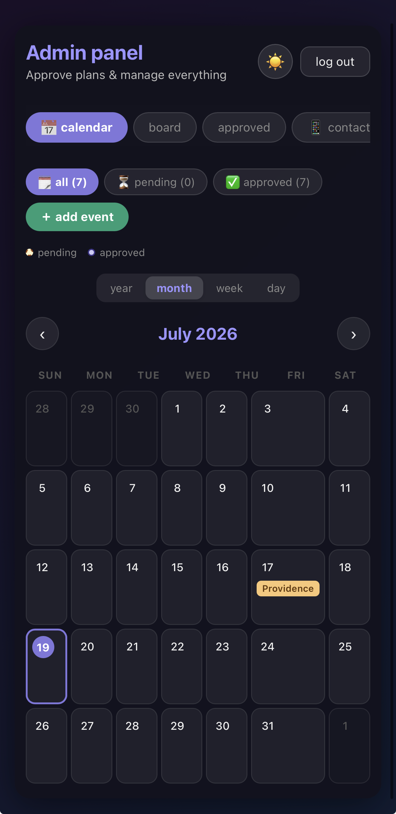

# 📅 Squad Calendar

**Plan together, show up together.**

A full-stack event planning app I built for my 11-person friend group — suggest hangouts, RSVP in one tap, and get SMS + push reminders so nobody misses a meetup. Live on the web and shipped as a native iOS app from the same codebase.

**🌐 Live:** [squadcal.app](https://squadcal.app)


<p align="center">
  
  
  
</p>


---

## ✨ Features

**For the squad**
- 🗓 **Four calendar views** — year, month, week, and an Apple Calendar-style day view with a time grid, duration blocks, and a live "now" line
- 🏕 **Multi-day events** — start/end dates, optional times, and an all-day toggle; events appear on every day they span
- 🙋 **One-tap RSVP** — the app remembers who you are; add your number for a text reminder
- 💡 **Suggest a plan** — pick a date and pitch it, or post a dateless idea straight to the Squad Board
- 🔔 **Push notifications** — instant alerts when a plan gets approved
- 🌙 **Dark mode** — full theming across the entire app

**For the admin**
- ✅ **Action board** — pending approvals, ideas, and announcements in one place; approve with an inline SMS-reminder setup
- 📱 **SMS announcements** — blast texts to selected contacts with per-recipient delivery tracking (✓/✕) and a rolling 30-message history page
- ⏰ **Automated reminders** — scheduled Cloud Function texts and pushes the evening before each event
- 👥 **Contact & RSVP management** — saved contacts checklist, manual RSVP adds, attendee removal
- 🗺 **Location autocomplete** — Mapbox-powered place search with static map previews on every event
- 🔐 **Hidden admin access** — separate admin subdomain on the web, plus a hidden gesture inside the iOS app, gated by Firebase Auth

---

## 🛠 Tech Stack

| Layer | Technology |
|---|---|
| Frontend | React, CSS-in-JS |
| Backend | Firebase — Firestore, Auth, Cloud Functions v2, Cloud Messaging |
| Scheduled jobs | Cloud Functions cron (daily reminder dispatch, log rotation) |
| SMS | Textbelt API |
| Maps & geocoding | Mapbox |
| Web hosting | Cloudflare Pages (CI/CD from this repo) |
| iOS app | Capacitor (native WebView shell, TestFlight distribution) |

---

## 🏗 Architecture Highlights

- **Fully serverless** — no servers to babysit. Cloud Functions handle push fan-out, SMS dispatch with per-recipient result logging, and automatic log trimming.
- **Real-time everywhere** — Firestore `onSnapshot` listeners keep every device in sync the moment a plan is approved or someone RSVPs.
- **One codebase, two surfaces** — the same React build deploys to Cloudflare Pages *and* wraps into a native iOS app via Capacitor.
- **Locked down** — Firestore security rules gate every write, auth sign-ups are disabled (invite-only admin), and API tokens are URL-restricted.

---

## 🚀 Running Locally

```bash
git clone https://github.com/Muhtasim19/squad-calendar.git
cd squad-calendar
npm install

# copy the env template and fill in your own Firebase + Mapbox keys
cp .env.example .env

npm start
```

Cloud Functions live in `functions/` and deploy with the Firebase CLI:

```bash
cd functions && npm install
firebase deploy --only functions
```

### iOS build

```bash
npm run build
npx cap sync ios
npx cap open ios   # then run from Xcode
```

---

## 📄 License

MIT © 2026 Muhtasim Haq